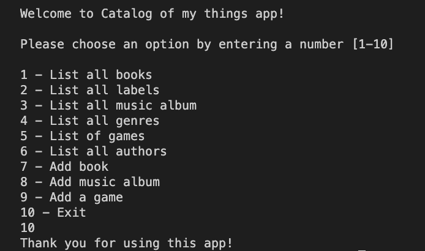
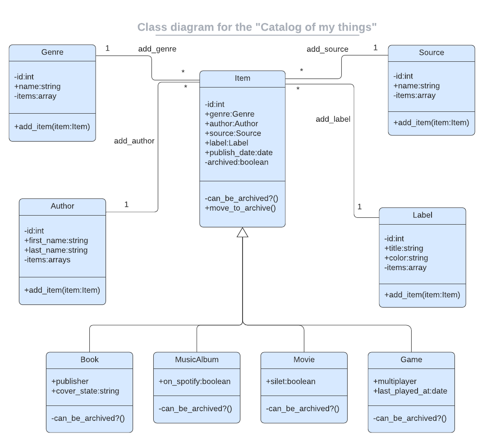

<a name="readme-top"></a>

# 📗 Table of Contents

- [📖 About the Project](#about-project) -[:video_camera: Video Presentation](#video-presentation)
  - [:camera: screenshot](#screenshot)
  - [🛠 Built With](#built-with)
    - [Tech Stack](#tech-stack)
    - [Key Features](#key-features)
- [💻 Getting Started](#getting-started)
  - [Setup](#setup)
  - [Prerequisites](#prerequisites)
  - [Usage](#usage)
- [👥 Authors](#authors)
- [🔭 Future Features](#future-features)
- [🤝 Contributing](#contributing)
- [⭐️ Show your support](#support)
- [🙏 Acknowledgements](#acknowledgements)

- [📝 License](#license)

# 📇 Catalog of my things <a name="about-project"></a>

> This project is console app built using ruby. It keeps a records of different things:

- books
- music
- albums
- movies
- games

Data are stored in json file and could be used whenever you start the app.

## :video_camera: Video Presentation <a name="video-presentation"></a>

[]()

## :camera: Screenshot <a name="Screen-shot"></a>

  
<br>
  

## 🛠 Built With <a name="built-with"></a>

### Tech Stack <a name="tech-stack"></a>

- <a href="https://www.ruby-lang.org/es/">Languages: Ruby</a>
- <a href="https://www.postgresql.org/">Postgresql</a>
- Frameworks: N/A
- Technologies Used: GIT, GITHUB, LINTERS

### Key Features <a name="key-features"></a>

- Keep track of all things own by a user
- Created using ruby to keep a records of different types of things a user own: books, music albums, movies, and games

<p align="right">(<a href="#readme-top">back to top</a>)</p>

## 💻 Getting Started <a name="getting-started"></a>

To get a local copy up and running, follow these steps.

### Prerequisites

In order to run this project you need:

- Command line or terminal
- IDE such as VsCode.
- Ruby needs to be installed on your system.

### Setup

Clone this repository to your desired folder:
Example command:

```sh
  git clone https://github.com/jugosack/catalog_my_things_Ruby
  cd catalog_my_things

```

### Install

Example command:

```sh
  cd catalog_my_things_Ruby
  bundle install (install all dependencies)

```

### Usage

To run the project redirecting to the root directory of the project and run the following command:

```sh
 ruby main.rb (to run console application)

```

### Test

To test the web app run the following command:

```sh
 rspec spec (to test the console application)

```

## 👥 Authors <a name="authors"></a>

👤 **Jugoslav Achkoski**

- GitHub: [@github](https://github.com/jugosack)
- LinkedIn: [LinkedIn](https://www.linkedin.com/in/jugoslavachkoski/)
- Twitter: [twitter](https://twitter.com/Jugoslav_A)
- Facebook: [facebook](https://www.facebook.com/jugoslav.ackoski/)

👤 **Uchechi Nwaka**

- -- GitHub: [@uchexm](https://github.com/uchexm)
- -- LinkedIn: [@nwakauc](https://www.linkedin.com/in/nwakauc/)
- -- Twiter [@nwakauc](https://twitter.com/Nwakauc)

<p align="right">(<a href="#readme-top">back to top</a>)</p>

## 🔭 Future Features <a name="future-features"></a>

- Add web interface
- Improve unit tests

<p align="right">(<a href="#readme-top">back to top</a>)</p>

## 🤝 Contributing <a name="contributing"></a>

Contributions, issues, and feature requests are welcome!

Feel free to check the [issues page](https://github.com/jugosack/catalog_my_things_Ruby/issues).

<p align="right">(<a href="#readme-top">back to top</a>)</p>

## ⭐️ Show your support <a name="support"></a>

Give a ⭐️ if you like this project!

<p align="right">(<a href="#readme-top">back to top</a>)</p>

## 🙏 Acknowledgments <a name="acknowledgements"></a>

we would like to thank microverse community for the support and guidance.

<p align="right">(<a href="#readme-top">back to top</a>)</p>

## 📝 License <a name="license"></a>

This project is [MIT](./LICENSE) licensed.

<p align="right">(<a href="#readme-top">back to top</a>)</p>
